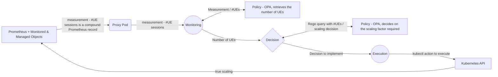

# Demo-2 user guide

This guide presents a demo summarizing the work done in 2024. Here, the framework from Demo-1 has been enhanced by allowing users to delegate the decision making logic of the loop to external applications. Delegation takes the form of sending queries and receiving responses form such applications. This significantly broadens the possibilities offered to the user to declaratively define the decision taking logic of loop components without the need to recompile the code and build new images of operator containers. In this demo, we use OPA/Rego policy engine as an example of external application playing the role of policy decision point. Adding other policy engines (i.e., other applications to work with) may need changes in the code of respective operators. 

#### Note: Mastering the installation of the environment and loop deployment process as outlined in README1.md is required to sucessfully recreate Demo-2.

In the demo we a set of loop components (custom controllers) similar to the one employed in Demo-1. That should facilitate transition to Demo-2 one Demo-1 has been made familiar with by the reader. The setup of the loop and overall workflow within the demo is depicted in Figure 1 below.

**_Figure 1. Demo workflow with external applications in the form of OPA policy engine._**


TODO: in the following, explain the loop structure and operation, and basic syntax based on the master CR presented below.

```yaml
apiVersion: closedlooppooc.closedloop.io/v1
kind: ClosedLoop
metadata:
  labels:
    app.kubernetes.io/name: closedloop
    app.kubernetes.io/instance: closedloop-sample
    app.kubernetes.io/part-of: closedloop
    app.kubernetes.io/managed-by: kustomize
    app.kubernetes.io/created-by: closedloop
  name: closedloop-v2
spec:
  message: "{}"
  monitoring:
    kind: Monitoringv2
    config: "{requestedpod: true}"
    message: "{}"
    policy:
      name: policy/closedloop_5g/inner/monitoring
      description: monitoring
      engine: 
        kind: opa
        url: "http://192.168.49.2:32633"
        api: 
          policy: /v1/policies/
          data: /v1/data/
      rule:
        name: policy.closedloop_5g.inner.monitoring
        body: |
          package policy.closedloop_5g.inner.monitoring
          import rego.v1
          default open5gs_amf_metric := ""
          open5gs_amf_metric := input.open5gs_amf_metric
      kind: threshold
      data: 
        name: closedloop_5g/inner/monitoring
        body: |
                {
                }
      input:
        schema: |
          {
            "type": "object",
            "properties": {
              "open5gs_amf_metric": {
                "type": "number"
              }
            }
          }
        value: "{\"open5gs_amf_metric\":\"#spec.message.data.result.0.value.1\"}" 
      result:
        schema: |
          {
            "type": "object",
            "properties": {
              "open5gs_amf_metric": {
                "type": "number"
              }
            }
          }
        value: "{\"open5gs_amf_metric\":\"cr:decision#spec.message.open5gs_amf_metric\"}"
  decision:
    kind: Decision
    config: "{}"
    message: "{}"
    policy:
      name: policy/closedloop_5g/inner/decision
      description: decision
      
      engine: 
        kind: opa
        url: "http://192.168.49.2:32633"
        api: 
          policy: /v1/policies/
          data: /v1/data/
      rule:
        name: policy.closedloop_5g.inner.decision
        body: | 
          package policy.closedloop_5g.inner.decision
          import rego.v1

          default cpu := ""

          cpu :=  "100m" if {
              to_number(input.open5gs_amf_metric) >= 0
                  to_number(input.open5gs_amf_metric) < 4
              }
          cpu :=  "150m" if {
              to_number(input.open5gs_amf_metric) >= 4
                  to_number(input.open5gs_amf_metric) < 8
              }
          cpu :=  "200m" if {
              to_number(input.open5gs_amf_metric) >= 8
                  to_number(input.open5gs_amf_metric) < 10
              }
          cpu :=  "250m" if {
              to_number(input.open5gs_amf_metric) >= 10
                  to_number(input.open5gs_amf_metric) <= 12
              }
      kind: priority
      data:
        name: closedloop_5g/inner/decision
        body: |
          {
          }
      input:
        schema: |
          {
            "type": "object",
            "properties": {
              "open5gs_amf_metric": {
                "type": "number"
              }
            }
          }
        value: "{\"open5gs_amf_metric\":\"#spec.message.open5gs_amf_metric\"}" 
      result:
        schema: |
          {
            "type": "object",
            "properties": {
              "cpu": {
                "type": "string"
              }
            }
          }
        value: "{\"cpu\":\"cr:execution#spec.message.cpu\"}" 
  execution:
    kind: Execution
    config: | 
      {
        "function": {
          "name": "Podpatch",
          "parameter": "cpu"
        }
      }
    message: "{}"
```

aaa
