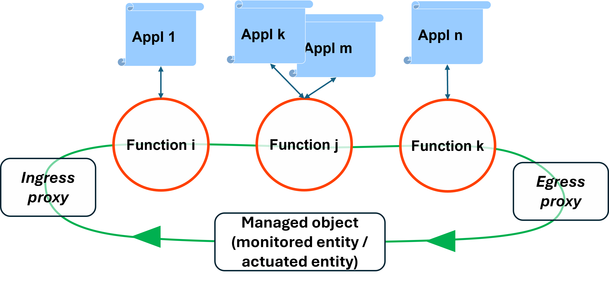
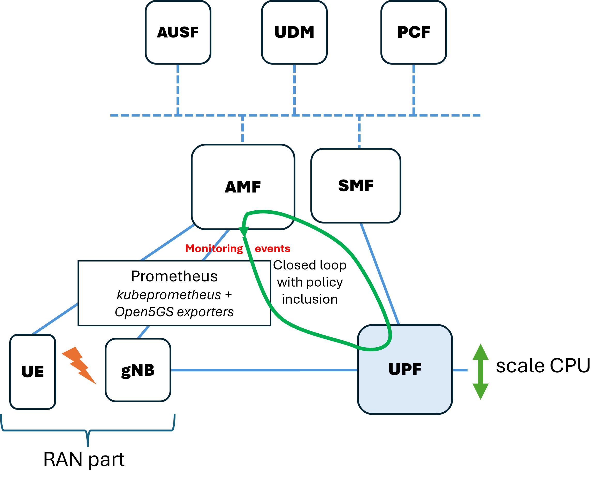
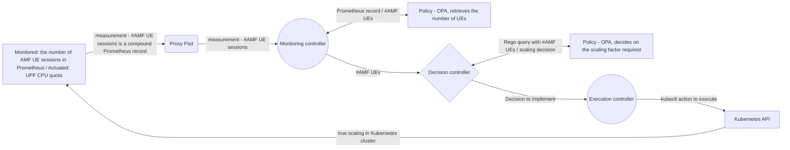

# Demo-2 user guide

This guide presents a demo summarizing the work done in 2024. Here, the framework from Demo-1 has been enhanced by allowing users to delegate the decision making logic of the loop to external applications. We refer to that as the enrichment of control loop. It takes the form of sending queries and receiving responses form such applications. This significantly broadens the possibilities offered to the user to declaratively define the decision taking logic of loop components without the need to recompile the code and build new images of operator containers. In this demo, we use OPA/Rego policy engine as an example of external application playing the role of policy decision point. Adding other policy engines (i.e., other applications to work with) may need changes in the code of respective operators. 

#### Note 1: Mastering the installation of the environment and loop deployment process as outlined in README1.md is required to sucessfully recreate Demo-2.

#### Note 2: In the following, we will occasionally use terms _user_, _admin_ and _developer_ to refer to specific roles related to the lifecycle of control loops. User role is responsible for defining master custom resource (and other artifacts as custom policy templates or components as external applications if nescessary) to run control loop instances; it represents an owner of the managed object who wants this object to be controlled in a specific way. Administrator role is responsible for preparation of the whole environment needed to run control loop sby users (this includes in particular setting up Kubernetes cluster where control loops are run, generating operator images, possibly also providing external applications and selected policy templates). And developer role is responsible for writing the code of controllers that provide the functionality of loop components.

Enrichment of operator-based control loop with external applications is shown schematically in Figure 1. In contrast to the loop architecture from Demo-1 where all computations and logic of the functinal blocks of the loop were hardcoded in respective controllers, now the controllers can refer to external modules to, e.g., query about the decisions to take or execute computationally expensive operations. Once the results of a quere have beed received, the controller can continute its internal workflow. As before (i.e., in Demo-1) this enrichment builds on top of a declarative style of defining the flow of operations within controlers. In this context, loop enrichment extends the possibilities to declaratively define control loops.

<p align="center">
  </img>
</p>
<p align="center">
  Figure 2. General view of control loop enriched with external applications.
</p>

In the following, we explain the operation of the loop and the rules for defining loop enrichment with external application based on a simple demonstrator. In the demo, we adopt a set of loop components (custom controllers) in a setup similar to the one known from Demo-1. We believe this similarity will facilitate running Demo-2 in case of users familiar with Demo-1. This time, 5G core network based on Open5GS platform serves as the managed object. More specifically, our control loop monitors the number of user sessions (UE sessions) registered in AFM and based on this scales the CPU resource of the UPF. Top level view of the demo is depicted in Figure 2.

<p align="center">
  </img>
</p>
<p align="center">
  Figure 2. Demo-2 top level view.
</p>

Internal setup of the loop and its overall workflow is depicted in greater detail in Figure 3 below. Similarly to Demo-1, main loop components are Monitoring controller, Decision controller and Execution controller. Hovever, in this case Monitoring and Decision controllers communicate with external policy engine (OPA in this case, using Rego query language) to derive needed data (in case of Monitoring) or decisions (in case of Decision). The communication with external applications is accomplished according to declarative specification included in respective custom resources, drawn form the master CR (master CR is the only CR explicitly defined by the user).


<p align="center">
  Figure 3. Demo workflow with external applications in the form of OPA policy engine.
</p>

TODO: in the following, explain the loop structure and operation, and basic syntax based on the master CR presented below.

**Template 1. Master custom resource of Demo-2 control loop.**
```yaml
apiVersion: closedlooppooc.closedloop.io/v1
kind: ClosedLoop
metadata:
  labels:
    app.kubernetes.io/name: closedloop
    app.kubernetes.io/instance: closedloop-sample
    app.kubernetes.io/part-of: closedloop
    app.kubernetes.io/managed-by: kustomize
    app.kubernetes.io/created-by: closedloop
  name: closedloop-v2
spec:
  message: "{}"
  monitoring:
    kind: Monitoringv2
    config: "{requestedpod: true}"
    message: "{}"
    policy:
      name: policy/closedloop_5g/inner/monitoring
      description: monitoring
      engine: 
        kind: opa
        url: "http://192.168.49.2:32633"
        api: 
          policy: /v1/policies/
          data: /v1/data/
      rule:
        name: policy.closedloop_5g.inner.monitoring
        body: |
          package policy.closedloop_5g.inner.monitoring
          import rego.v1
          default open5gs_amf_metric := ""
          open5gs_amf_metric := input.open5gs_amf_metric
      kind: threshold
      data: 
        name: closedloop_5g/inner/monitoring
        body: |
                {
                }
      input:
        schema: |
          {
            "type": "object",
            "properties": {
              "open5gs_amf_metric": {
                "type": "number"
              }
            }
          }
        value: "{\"open5gs_amf_metric\":\"#spec.message.data.result.0.value.1\"}" 
      result:
        schema: |
          {
            "type": "object",
            "properties": {
              "open5gs_amf_metric": {
                "type": "number"
              }
            }
          }
        value: "{\"open5gs_amf_metric\":\"cr:decision#spec.message.open5gs_amf_metric\"}"
  decision:
    kind: Decision
    config: "{}"
    message: "{}"
    policy:
      name: policy/closedloop_5g/inner/decision
      description: decision
      
      engine: 
        kind: opa
        url: "http://192.168.49.2:32633"
        api: 
          policy: /v1/policies/
          data: /v1/data/
      rule:
        name: policy.closedloop_5g.inner.decision
        body: | 
          package policy.closedloop_5g.inner.decision
          import rego.v1

          default cpu := ""

          cpu :=  "100m" if {
              to_number(input.open5gs_amf_metric) >= 0
                  to_number(input.open5gs_amf_metric) < 4
              }
          cpu :=  "150m" if {
              to_number(input.open5gs_amf_metric) >= 4
                  to_number(input.open5gs_amf_metric) < 8
              }
          cpu :=  "200m" if {
              to_number(input.open5gs_amf_metric) >= 8
                  to_number(input.open5gs_amf_metric) < 10
              }
          cpu :=  "250m" if {
              to_number(input.open5gs_amf_metric) >= 10
                  to_number(input.open5gs_amf_metric) <= 12
              }
      kind: priority
      data:
        name: closedloop_5g/inner/decision
        body: |
          {
          }
      input:
        schema: |
          {
            "type": "object",
            "properties": {
              "open5gs_amf_metric": {
                "type": "number"
              }
            }
          }
        value: "{\"open5gs_amf_metric\":\"#spec.message.open5gs_amf_metric\"}" 
      result:
        schema: |
          {
            "type": "object",
            "properties": {
              "cpu": {
                "type": "string"
              }
            }
          }
        value: "{\"cpu\":\"cr:execution#spec.message.cpu\"}" 
  execution:
    kind: Execution
    config: | 
      {
        "function": {
          "name": "Podpatch",
          "parameter": "cpu"
        }
      }
    message: "{}"
```
TODO: here, explanations to the points marked in Template 1 will be included to describe the syntax and semantics of the constructs used to define loop structure and operation flow within controllers (controllers correspond to functional blocks of the loop).
