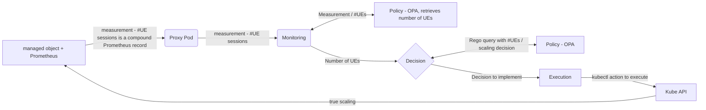

# blahblahblah


Figure 1. Demo setup with external applications in the form of OPA policy engine.



```yaml
apiVersion: closedlooppooc.closedloop.io/v1
kind: ClosedLoop
metadata:
  labels:
    app.kubernetes.io/name: closedloop
    app.kubernetes.io/instance: closedloop-sample
    app.kubernetes.io/part-of: closedloop
    app.kubernetes.io/managed-by: kustomize
    app.kubernetes.io/created-by: closedloop
  name: closedloop-v2
spec:
  message: "{}"
  monitoring:
    kind: Monitoringv2
    config: "{requestedpod: true}"
    message: "{}"
    policy:
      name: policy/closedloop_5g/inner/monitoring
      description: monitoring
      engine: 
        kind: opa
        url: "http://192.168.49.2:32633"
        api: 
          policy: /v1/policies/
          data: /v1/data/
      rule:
        name: policy.closedloop_5g.inner.monitoring
        body: |
          package policy.closedloop_5g.inner.monitoring
          import rego.v1
          default open5gs_amf_metric := ""
          open5gs_amf_metric := input.open5gs_amf_metric
      kind: threshold
      data: 
        name: closedloop_5g/inner/monitoring
        body: |
                {
                }
      input:
        schema: |
          {
            "type": "object",
            "properties": {
              "open5gs_amf_metric": {
                "type": "number"
              }
            }
          }
        value: "{\"open5gs_amf_metric\":\"#spec.message.data.result.0.value.1\"}" 
      result:
        schema: |
          {
            "type": "object",
            "properties": {
              "open5gs_amf_metric": {
                "type": "number"
              }
            }
          }
        value: "{\"open5gs_amf_metric\":\"cr:decision#spec.message.open5gs_amf_metric\"}"
  decision:
    kind: Decision
    config: "{}"
    message: "{}"
    policy:
      name: policy/closedloop_5g/inner/decision
      description: decision
      
      engine: 
        kind: opa
        url: "http://192.168.49.2:32633"
        api: 
          policy: /v1/policies/
          data: /v1/data/
      rule:
        name: policy.closedloop_5g.inner.decision
        body: | 
          package policy.closedloop_5g.inner.decision
          import rego.v1

          default cpu := ""

          cpu :=  "100m" if {
              to_number(input.open5gs_amf_metric) >= 0
                  to_number(input.open5gs_amf_metric) < 4
              }
          cpu :=  "150m" if {
              to_number(input.open5gs_amf_metric) >= 4
                  to_number(input.open5gs_amf_metric) < 8
              }
          cpu :=  "200m" if {
              to_number(input.open5gs_amf_metric) >= 8
                  to_number(input.open5gs_amf_metric) < 10
              }
          cpu :=  "250m" if {
              to_number(input.open5gs_amf_metric) >= 10
                  to_number(input.open5gs_amf_metric) <= 12
              }
      kind: priority
      data:
        name: closedloop_5g/inner/decision
        body: |
          {
          }
      input:
        schema: |
          {
            "type": "object",
            "properties": {
              "open5gs_amf_metric": {
                "type": "number"
              }
            }
          }
        value: "{\"open5gs_amf_metric\":\"#spec.message.open5gs_amf_metric\"}" 
      result:
        schema: |
          {
            "type": "object",
            "properties": {
              "cpu": {
                "type": "string"
              }
            }
          }
        value: "{\"cpu\":\"cr:execution#spec.message.cpu\"}" 
  execution:
    kind: Execution
    config: | 
      {
        "function": {
          "name": "Podpatch",
          "parameter": "cpu"
        }
      }
    message: "{}"
```

aaa
